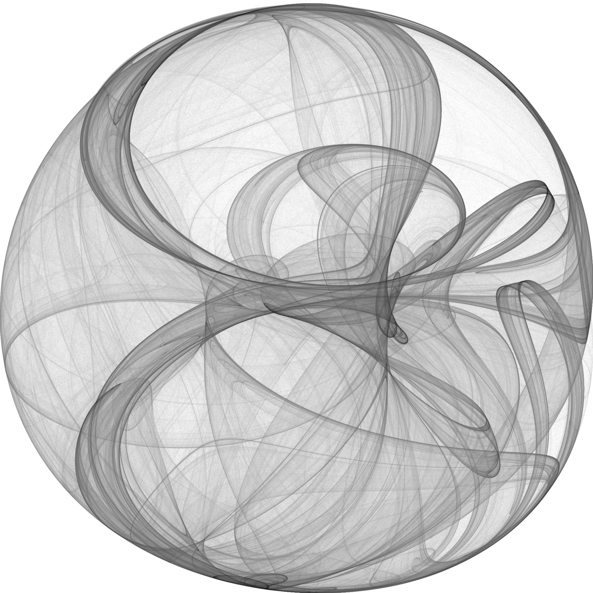
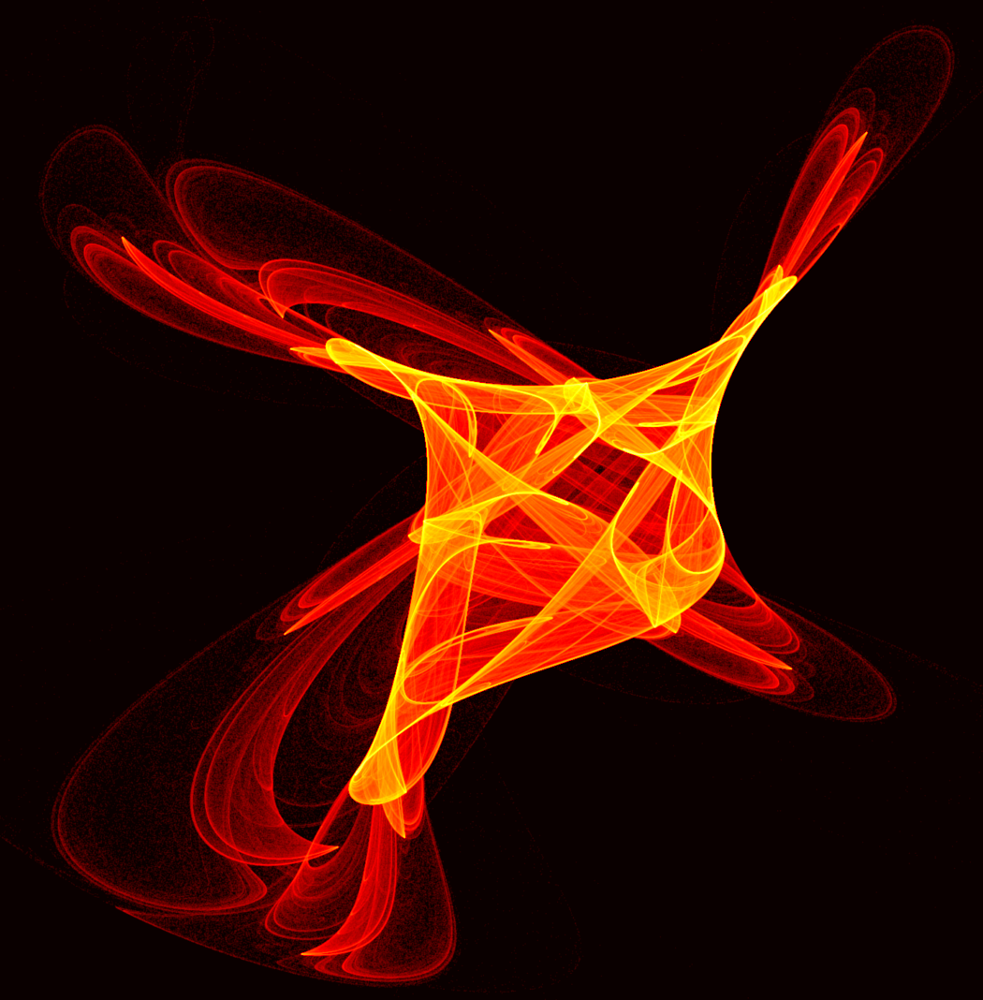

# Attractive Clifford Attractors

Want to create your own images like this one

or this one

or this one

?

Look no further! This Jupyter Notebook provides you with anything you need, with minimal dependencies (NumPy, Cython, Matplotlib).
